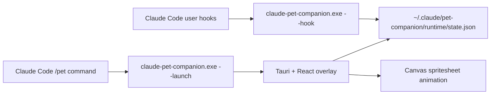

# Claude Pet Companion

[简体中文](./README.zh-CN.md) | English

Claude Pet Companion is a standalone desktop pet overlay for Claude Code. It does not replace Claude Code's built-in features and does not use the terminal status line. Instead, Claude Code user-level hooks write runtime state, and a transparent Tauri window reads that state to play matching spritesheet animations.

## Highlights

- Transparent, frameless, always-on-top desktop pet window.
- Right-click menu for bilingual UI, pet switching, Codex pet scan, pet import, scale, always-on-top, and quit.
- One `.exe` can install hooks, create the `/pet` slash command, and launch the pet.
- `/pet` in Claude Code launches or focuses the companion.
- `/pet <description>` starts a Claude Code pet-creation workflow for a recognizable companion pet package.
- User-level hooks track running, waiting for permission, failed, review, and idle states.
- Visible prompt bubble when Claude Code is waiting for your permission.
- Compatible with Codex-style pet packages and automatically syncs pets installed under `~/.codex/pets`.
- Hook installer backs up `~/.claude/settings.json` before writing changes.
- Uninstaller only removes handlers owned by this project.

## Architecture



Claude Code sends hook input to `claude-pet-companion.exe --hook`. The executable writes `runtime/state.json` quickly and exits. The desktop overlay polls that file and renders the matching row from the active pet spritesheet.

## For Users

### Requirements

- Windows 10 or Windows 11.
- Claude Code.
- Microsoft Edge WebView2 Runtime.

You do not need Node.js or Rust when using a release installer.

### Install

Download and run the NSIS installer from a release:

```text
Claude Pet Companion_0.1.0_x64-setup.exe
```

Then open `claude-pet-companion.exe`. On first launch it will:

- Create `~/.claude/pet-companion/config.json`.
- Install Claude Code user-level hooks.
- Create the Claude Code personal command `~/.claude/commands/pet.md`.
- Launch the transparent desktop pet window.

The installer keeps your existing Claude settings, including `statusLine`, plugins, and unrelated hooks.

### Use From Claude Code

In Claude Code, type:

```text
/pet
```

This launches or focuses the pet. If the pet is already open, it will be focused and briefly play the waving state.

With arguments, `/pet` becomes a pet workflow command:

```text
/pet make a tiny moon rabbit with a brass staff
/pet import C:\Users\ASUS\Downloads\my-pet
/pet switch hiyue
/pet sync
```

Claude Code will use the installed `claude-pet-companion` skill to create, validate, import, switch, or sync recognizable desktop pet packages.

### Desktop Controls

- Drag the pet window by holding the transparent area.
- Right-click the pet, or click the top-right dot button, to open the control panel.
- Use the panel to switch Chinese/English UI, switch pets, scan Codex pets, import a pet folder, scale the pet, toggle always-on-top, or quit.

### Language

Open the pet menu and change **Language** to either **中文** or **English**. The choice is saved in:

```text
%USERPROFILE%\.claude\pet-companion\config.json
```

The prompt bubble, menu labels, status captions, and import dialog title follow the selected language.

### Pet Behavior

| Claude Code situation | Pet state |
| --- | --- |
| Idle session | `idle` |
| Prompt submitted or tools running | `running` |
| Permission prompt or elicitation dialog | `waiting` |
| Tool failure or permission denied | `failed` |
| Response finished | `review`, then `idle` |

When Claude Code asks for permission, the pet shows a visible bubble telling you to return to the terminal and choose Yes or No.

The overlay also has a small Codex-like motion layer:

- `/pet` launch briefly plays `waving`.
- Prompt submission briefly plays `waving` before task work.
- Dragging the pet uses `running-left` or `running-right`.
- Completed responses briefly play `jumping` before review.
- Long idle periods occasionally play a small `waving` or `jumping` flourish.

### Import Pets

A pet package is a folder containing:

```text
pet.json
spritesheet.webp
```

Open the pet menu and choose **Import Pet Folder**. Imported pets are copied to:

```text
%USERPROFILE%\.claude\pet-companion\pets
```

### Use Pets Installed By Codex

Yes. The companion recognizes Codex-compatible pets installed under:

```text
%USERPROFILE%\.codex\pets
```

On startup, it scans that directory and copies valid packages into:

```text
%USERPROFILE%\.claude\pet-companion\pets
```

You can also open the pet menu and choose **Scan Codex Pets**. Valid Codex pets appear in the same pet selector without restarting Claude Code.

From a terminal or from the installed `/pet` skill workflow, the same operation is available as:

```powershell
.\claude-pet-companion.exe --sync-codex-pets
```

### Uninstall Hooks

From the installed application folder:

```powershell
.\claude-pet-companion.exe --uninstall
```

This removes only this companion's hooks and `/pet` command. It does not remove unrelated Claude Code settings.

## For Developers

### Requirements

- Node.js 20+.
- Rust stable toolchain.
- Tauri 2 prerequisites for Windows.
- Microsoft Edge WebView2 Runtime.
- Claude Code for end-to-end hook testing.

### Setup

```powershell
git clone <your-repo-url> claude-pet-companion
cd claude-pet-companion
npm install
```

### Run In Development

```powershell
npm run tauri:dev
```

Install hooks during development:

```powershell
npm run install-hooks
```

Uninstall hooks:

```powershell
npm run uninstall-hooks
```

### Build Release

```powershell
npm run tauri:build
```

Artifacts are generated under:

```text
src-tauri/target/release/claude-pet-companion.exe
src-tauri/target/release/bundle/nsis/
src-tauri/target/release/bundle/msi/
```

### Executable Commands

The release executable includes the installer, hook handler, launcher, and state writer:

```powershell
.\claude-pet-companion.exe --install
.\claude-pet-companion.exe --uninstall
.\claude-pet-companion.exe --launch --state waving --event manual-launch --ttl-ms 3000
.\claude-pet-companion.exe --hook --state waiting --event manual-hook
.\claude-pet-companion.exe --import-pet "C:\path\to\pet-package"
.\claude-pet-companion.exe --set-pet hiyue
.\claude-pet-companion.exe --sync-codex-pets
```

The Node hook handler remains available for local debugging:

```powershell
node .\hook\claude-pet-hook.mjs --state waiting --event manual-node-hook
```

### Simulate Claude Code Events

Permission prompt:

```powershell
'{"hook_event_name":"Notification","notification_type":"permission_prompt","message":"Do you want to proceed?","tool_name":"Bash"}' | .\src-tauri\target\release\claude-pet-companion.exe --hook
```

Tool running:

```powershell
'{"hook_event_name":"PreToolUse","tool_name":"Bash"}' | .\src-tauri\target\release\claude-pet-companion.exe --hook
```

Failure:

```powershell
.\src-tauri\target\release\claude-pet-companion.exe --hook --state failed --event manual-failure --ttl-ms 3000
```

### Project Layout

```text
src/                         React overlay UI
src-tauri/                   Tauri shell and native commands
hook/claude-pet-hook.mjs     Node hook handler for development fallback
scripts/install-hooks.mjs    Development hook installer
scripts/uninstall-hooks.mjs  Development hook uninstaller
config.example.json          Example local config
launch-pet.vbs               Hidden-window launcher for local release exe
```

The installer also writes a Claude Code skill to:

```text
%USERPROFILE%\.claude\skills\claude-pet-companion\SKILL.md
```

That skill defines how `/pet <description>`, `/pet import <folder>`, and `/pet switch <pet-id>` should behave.

### Configuration

Runtime config is created at:

```text
%USERPROFILE%\.claude\pet-companion\config.json
```

Default pet sources:

```text
%USERPROFILE%\.codex\pets
%USERPROFILE%\.claude\pet-companion\pets
```

See [config.example.json](./config.example.json).

Config fields:

| Field | Meaning |
| --- | --- |
| `activePetId` | Currently selected pet id. |
| `language` | UI language, currently `zh-CN` or `en`. |
| `petSources` | Directories scanned for `pet.json` packages. |
| `window.scale` | Pet scale, clamped by the UI between 50% and 250%. |
| `window.alwaysOnTop` | Whether the overlay stays above other windows. |

### Codex Pet Sync Rules

`--sync-codex-pets` and the **Scan Codex Pets** button:

- Scan one level under `%USERPROFILE%\.codex\pets`.
- Accept folders that contain a readable `pet.json` and the referenced spritesheet.
- Copy each valid package to `%USERPROFILE%\.claude\pet-companion\pets\<id>`.
- Normalize the copied manifest so `spritesheetPath` points to `spritesheet.webp`.
- Refresh the running overlay through `runtime/state.json` when invoked from the CLI.
- Never modify Codex's original pet package.

### Pet Package Format

`pet.json`:

```json
{
  "id": "hiyue",
  "displayName": "Hiyue",
  "description": "Optional description",
  "spritesheetPath": "spritesheet.webp"
}
```

Spritesheet requirements:

- Size: `1536x1872`.
- Grid: 8 columns x 9 rows.
- Frame size: `192x208`.
- Row order: `idle`, `running-right`, `running-left`, `waving`, `jumping`, `failed`, `waiting`, `running`, `review`.

### Hook Mapping

| Claude Code event | State | Notes |
| --- | --- | --- |
| `SessionStart`, `SessionEnd` | `idle` | Session starts or ends. |
| `UserPromptSubmit`, `UserPromptExpansion` | `running` | User input has been submitted. |
| `PreToolUse`, `PostToolUse`, `PostToolBatch` | `running` | Tool execution activity. |
| `SubagentStart`, `TaskCreated` | `running` | Background or delegated work starts. |
| `PermissionRequest`, `Notification(permission_prompt)`, `Elicitation` | `waiting` | User action is needed. |
| `PostToolUseFailure`, `PermissionDenied`, `StopFailure` | `failed` | Error or denied action. |
| `Stop`, `SubagentStop`, `TaskCompleted` | `review` | Completed response, then returns to idle. |

### Safety Notes

- Do not commit `config.json`, `runtime/`, `pets/`, `dist/`, `node_modules/`, or `src-tauri/target/`.
- Do not commit private `~/.claude/settings.json` files or secrets.
- The installer backs up settings before modifying hooks.
- The uninstaller removes only commands containing `claude-pet-companion` or `claude-pet-hook.mjs`.

## Troubleshooting

### `/pet` Does Not Appear

Run:

```powershell
.\claude-pet-companion.exe --install
```

Then restart Claude Code or start a new session.

### Pet Does Not React To Permission Prompts

Check the state file:

```powershell
Get-Content "$env:USERPROFILE\.claude\pet-companion\runtime\state.json"
```

For permission prompts, it should contain `waiting` and `notification:permission_prompt`.

### A Terminal Window Appears

Use the release executable or installer. Development commands may open terminals, but the release app is built as a Windows GUI subsystem application.

## License

MIT
