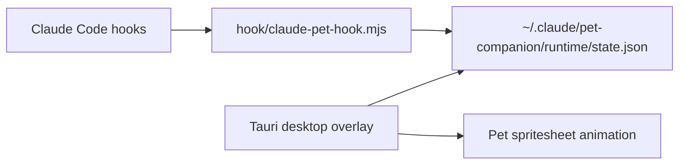

# Claude Pet Companion

一个独立的 Claude Code 桌面宠物伴侣。它不会替换 Claude Code 内置功能，也不会占用终端状态行，而是通过用户级 hooks 写入状态文件，再由 Tauri 透明悬浮窗播放对应的宠物 spritesheet 动画。

## Features

- 透明、无边框、置顶的桌面悬浮窗
- 右键菜单支持切换宠物、导入宠物文件夹、缩放、置顶开关和退出
- 自动扫描 Codex 宠物目录和本地导入目录
- Claude Code 用户级 hooks 驱动状态：运行中、等待权限、失败、完成回顾等
- 安装 hooks 前自动备份 `~/.claude/settings.json`
- 卸载脚本只移除指向本项目 hook handler 的配置，不影响 `statusLine`、`claude-hud` 或其它 Claude settings

## How It Works



Claude Code 触发 hook 后，Node handler 会快速写入 `runtime/state.json` 并退出。桌面宠物窗口轮询该文件，然后在 canvas 上裁切并播放对应行的 spritesheet 帧。

## Requirements

- Windows 10/11
- Claude Code
- Node.js 20+
- Rust 和 Tauri 2 构建环境
- Microsoft Edge WebView2 Runtime

## Quick Start

```powershell
git clone <your-repo-url> claude-pet-companion
cd claude-pet-companion
npm install
npm run install-hooks
npm run tauri:dev
```

开发模式会打开 Tauri 悬浮窗。发布版构建：

```powershell
npm run tauri:build
.\src-tauri\target\release\claude-pet-companion.exe
```

如果希望从脚本静默启动发布版：

```powershell
wscript.exe //B //Nologo .\launch-pet.vbs
```

## Configuration

首次运行会自动创建：

```text
%USERPROFILE%\.claude\pet-companion\config.json
```

默认配置会扫描：

```text
%USERPROFILE%\.codex\pets
%USERPROFILE%\.claude\pet-companion\pets
```

示例见 [config.example.json](./config.example.json)。

## Pet Package Format

一个宠物包是一个文件夹，至少包含：

```text
pet.json
spritesheet.webp
```

`pet.json`:

```json
{
  "id": "hiyue",
  "displayName": "绯月",
  "description": "Optional description",
  "spritesheetPath": "spritesheet.webp"
}
```

Spritesheet 要求：

- 文件尺寸：`1536x1872`
- 网格：8 列 x 9 行
- 单帧：`192x208`
- 行顺序：`idle`、`running-right`、`running-left`、`waving`、`jumping`、`failed`、`waiting`、`running`、`review`

## Claude Code Hooks

安装：

```powershell
npm run install-hooks
```

卸载：

```powershell
npm run uninstall-hooks
```

状态映射：

| Claude Code event | Pet state |
| --- | --- |
| `SessionStart`, `SessionEnd` | `idle` |
| `UserPromptSubmit`, `UserPromptExpansion`, `PreToolUse`, `PostToolUse`, `PostToolBatch`, `SubagentStart`, `TaskCreated` | `running` |
| `PermissionRequest`, `Notification(permission_prompt/idle_prompt/elicitation_dialog)`, `Elicitation` | `waiting` |
| `PostToolUseFailure`, `PermissionDenied`, `StopFailure` | `failed` |
| `Stop`, `SubagentStop`, `TaskCompleted` | `review` then `idle` |

Hook handler:

```text
%USERPROFILE%\.claude\pet-companion\hook\claude-pet-hook.mjs
```

Runtime state:

```text
%USERPROFILE%\.claude\pet-companion\runtime\state.json
```

## Manual Testing

```powershell
node .\hook\claude-pet-hook.mjs --state running --event manual-test
node .\hook\claude-pet-hook.mjs --state waiting --event permission-test
node .\hook\claude-pet-hook.mjs --state failed --event failure-test --ttl-ms 3000
```

Simulate a Claude permission notification:

```powershell
'{"hook_event_name":"Notification","notification_type":"permission_prompt","message":"Do you want to proceed?"}' | node .\hook\claude-pet-hook.mjs
```

Recent hook events are recorded in:

```text
%USERPROFILE%\.claude\pet-companion\runtime\hook-events.jsonl
```

## Development

```powershell
npm install
npm run build
npm run tauri:dev
```

Source layout:

```text
src/                         React overlay UI
src-tauri/                   Tauri shell and native commands
hook/claude-pet-hook.mjs     Claude Code hook handler
scripts/install-hooks.mjs    User-level hook installer
scripts/uninstall-hooks.mjs  Hook uninstaller
```

## Safety Notes

- Do not commit `config.json`, `runtime/`, `pets/`, `dist/`, `node_modules/`, or `src-tauri/target/`.
- Do not commit private Claude settings or secrets.
- The installer writes only user-level hooks and backs up settings first.
- The uninstaller removes only handlers whose command points to `claude-pet-hook.mjs`.
