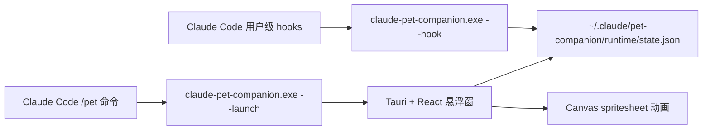

# Claude Pet Companion

简体中文 | [English](./README.md)

Claude Pet Companion 是一个独立的 Claude Code 桌面宠物伴侣。它不会替换 Claude Code 内置功能，也不会占用终端状态行，而是通过 Claude Code 用户级 hooks 写入运行状态，再由 Tauri 透明悬浮窗读取状态并播放对应的宠物 spritesheet 动画。

## 功能亮点

- 透明、无边框、置顶的桌面宠物窗口。
- 右键菜单支持中英切换、切换宠物、扫描 Codex 宠物、导入宠物、缩放、置顶开关和退出。
- 一个 `.exe` 可完成 hooks 安装、`/pet` 命令安装和桌宠启动。
- 在 Claude Code 中输入 `/pet` 可唤出或聚焦桌宠。
- 输入 `/pet <描述>` 可让 Claude Code 进入可识别桌宠包的创建流程。
- 用户级 hooks 自动感知运行中、等待权限、失败、完成回顾和空闲状态。
- Claude Code 等待权限确认时，桌宠会显示明显的提示气泡。
- 兼容 Codex 风格宠物包，并会自动同步安装在 `~/.codex/pets` 下的跟宠。
- 安装 hooks 前会备份 `~/.claude/settings.json`。
- 卸载时只移除本项目自己的 hooks 和 `/pet` 命令，不动其它 Claude Code 配置。

## 工作原理



Claude Code 触发 hook 后，会调用 `claude-pet-companion.exe --hook`。该 exe 快速写入 `runtime/state.json` 后退出。桌面宠物窗口轮询这个状态文件，并从当前宠物 spritesheet 中裁切对应行的动画帧进行播放。

## 给普通用户

### 使用要求

- Windows 10 或 Windows 11。
- Claude Code。
- Microsoft Edge WebView2 Runtime。

如果使用发布版安装器，不需要安装 Node.js 或 Rust。

### 安装

从 Release 下载并运行 NSIS 安装器：

```text
Claude Pet Companion_0.1.0_x64-setup.exe
```

安装后打开 `claude-pet-companion.exe`。首次启动会自动完成：

- 创建 `~/.claude/pet-companion/config.json`。
- 写入 Claude Code 用户级 hooks。
- 创建 Claude Code 个人命令 `~/.claude/commands/pet.md`。
- 启动透明桌面宠物窗口。

安装过程会保留你已有的 Claude Code 配置，包括 `statusLine`、插件和其它无关 hooks。

### 在 Claude Code 中使用

在 Claude Code 中输入：

```text
/pet
```

这会唤出或聚焦桌宠。如果桌宠已经打开，会聚焦已有窗口，并短暂播放挥手状态。

带参数时，`/pet` 会变成桌宠工作流命令：

```text
/pet 做一只拿金箍棒的月亮兔桌宠
/pet import C:\Users\ASUS\Downloads\my-pet
/pet switch hiyue
/pet sync
```

Claude Code 会使用安装好的 `claude-pet-companion` skill 来创建、校验、导入、切换或同步可被桌宠程序识别的宠物包。

### 桌面控制

- 按住透明区域可以拖动桌宠窗口。
- 右键桌宠，或点击右上角小点按钮，可以打开控制面板。
- 控制面板支持切换中文/英文界面、切换宠物、扫描 Codex 宠物、导入宠物文件夹、缩放、切换置顶和退出。

### 界面语言

打开桌宠菜单，把 **界面语言** 切换为 **中文** 或 **English** 即可。选择会保存到：

```text
%USERPROFILE%\.claude\pet-companion\config.json
```

提示气泡、菜单文案、状态字幕和导入文件夹弹窗标题都会跟随这个设置。

### 桌宠状态

| Claude Code 情况 | 桌宠状态 |
| --- | --- |
| 会话空闲 | `idle` |
| 提交 prompt 或工具运行中 | `running` |
| 等待权限确认或需要用户输入 | `waiting` |
| 工具失败或权限被拒绝 | `failed` |
| 回复完成 | `review`，随后回到 `idle` |

当 Claude Code 弹出权限确认时，桌宠会出现提示气泡，提醒你回到终端选择 Yes 或 No。

悬浮窗还加入了一层更接近 Codex 跟宠的动作编排：

- `/pet` 唤出时短暂播放 `waving`。
- 用户提交 prompt 后，先短暂 `waving`，再进入任务工作状态。
- 拖动桌宠时根据方向播放 `running-left` 或 `running-right`。
- 回复完成时先短暂 `jumping`，再进入 `review`。
- 长时间空闲时，偶尔播放一次 `waving` 或 `jumping` 小动作。

### 导入宠物

一个宠物包是一个文件夹，至少包含：

```text
pet.json
spritesheet.webp
```

在桌宠菜单中选择 **Import Pet Folder**，选择宠物包文件夹即可。导入后的宠物会复制到：

```text
%USERPROFILE%\.claude\pet-companion\pets
```

### 使用 Codex 已安装的跟宠

可以。这个桌宠伴侣会识别安装在下面目录的 Codex 兼容跟宠：

```text
%USERPROFILE%\.codex\pets
```

启动时，程序会扫描该目录，并把有效宠物包复制到：

```text
%USERPROFILE%\.claude\pet-companion\pets
```

你也可以打开桌宠菜单，点击 **扫描 Codex 宠物**。有效的 Codex 跟宠会出现在同一个宠物选择框里，不需要重启 Claude Code。

在终端或已安装的 `/pet` skill 工作流中，也可以用同一个 exe 命令触发同步：

```powershell
.\claude-pet-companion.exe --sync-codex-pets
```

### 卸载 hooks

在安装目录运行：

```powershell
.\claude-pet-companion.exe --uninstall
```

这只会移除本项目安装的 hooks 和 `/pet` 命令，不会删除其它 Claude Code 配置。

## 给开发者

### 开发要求

- Node.js 20+。
- Rust stable toolchain。
- Windows 上的 Tauri 2 构建环境。
- Microsoft Edge WebView2 Runtime。
- Claude Code，用于端到端 hooks 测试。

### 初始化

```powershell
git clone <your-repo-url> claude-pet-companion
cd claude-pet-companion
npm install
```

### 开发运行

```powershell
npm run tauri:dev
```

开发环境安装 hooks：

```powershell
npm run install-hooks
```

开发环境卸载 hooks：

```powershell
npm run uninstall-hooks
```

### 构建发布版

```powershell
npm run tauri:build
```

构建产物位置：

```text
src-tauri/target/release/claude-pet-companion.exe
src-tauri/target/release/bundle/nsis/
src-tauri/target/release/bundle/msi/
```

### exe 命令

发布版 exe 内置安装器、hook handler、启动器和状态写入能力：

```powershell
.\claude-pet-companion.exe --install
.\claude-pet-companion.exe --uninstall
.\claude-pet-companion.exe --launch --state waving --event manual-launch --ttl-ms 3000
.\claude-pet-companion.exe --hook --state waiting --event manual-hook
.\claude-pet-companion.exe --import-pet "C:\path\to\pet-package"
.\claude-pet-companion.exe --set-pet hiyue
.\claude-pet-companion.exe --sync-codex-pets
```

Node 版 hook handler 仍保留，方便开发时调试：

```powershell
node .\hook\claude-pet-hook.mjs --state waiting --event manual-node-hook
```

### 模拟 Claude Code 事件

模拟权限提示：

```powershell
'{"hook_event_name":"Notification","notification_type":"permission_prompt","message":"Do you want to proceed?","tool_name":"Bash"}' | .\src-tauri\target\release\claude-pet-companion.exe --hook
```

模拟工具运行：

```powershell
'{"hook_event_name":"PreToolUse","tool_name":"Bash"}' | .\src-tauri\target\release\claude-pet-companion.exe --hook
```

模拟失败：

```powershell
.\src-tauri\target\release\claude-pet-companion.exe --hook --state failed --event manual-failure --ttl-ms 3000
```

### 项目结构

```text
src/                         React 悬浮窗 UI
src-tauri/                   Tauri 外壳和原生命令
hook/claude-pet-hook.mjs     Node 版 hook handler，作为开发兜底
scripts/install-hooks.mjs    开发环境 hooks 安装脚本
scripts/uninstall-hooks.mjs  开发环境 hooks 卸载脚本
config.example.json          本地配置示例
launch-pet.vbs               本地 release exe 静默启动脚本
```

安装器也会写入 Claude Code skill：

```text
%USERPROFILE%\.claude\skills\claude-pet-companion\SKILL.md
```

该 skill 定义了 `/pet <描述>`、`/pet import <folder>` 和 `/pet switch <pet-id>` 的行为。

### 配置文件

运行时配置会创建在：

```text
%USERPROFILE%\.claude\pet-companion\config.json
```

默认宠物扫描目录：

```text
%USERPROFILE%\.codex\pets
%USERPROFILE%\.claude\pet-companion\pets
```

示例见 [config.example.json](./config.example.json)。

配置字段：

| 字段 | 含义 |
| --- | --- |
| `activePetId` | 当前选中的宠物 id。 |
| `language` | UI 语言，目前支持 `zh-CN` 和 `en`。 |
| `petSources` | 扫描 `pet.json` 宠物包的目录列表。 |
| `window.scale` | 桌宠缩放，UI 中限制在 50% 到 250%。 |
| `window.alwaysOnTop` | 悬浮窗是否保持置顶。 |

### Codex 跟宠同步规则

`--sync-codex-pets` 和 **扫描 Codex 宠物** 按钮会：

- 扫描 `%USERPROFILE%\.codex\pets` 下一级目录。
- 接受包含可读取 `pet.json` 且 spritesheet 文件存在的文件夹。
- 把有效宠物包复制到 `%USERPROFILE%\.claude\pet-companion\pets\<id>`。
- 规范化复制后的 manifest，让 `spritesheetPath` 指向 `spritesheet.webp`。
- 如果通过 CLI 触发，会通过 `runtime/state.json` 通知正在运行的悬浮窗刷新。
- 不修改 Codex 原始宠物包。

### 宠物包格式

`pet.json`：

```json
{
  "id": "hiyue",
  "displayName": "绯月",
  "description": "Optional description",
  "spritesheetPath": "spritesheet.webp"
}
```

Spritesheet 要求：

- 文件尺寸：`1536x1872`。
- 网格：8 列 x 9 行。
- 单帧：`192x208`。
- 行顺序：`idle`、`running-right`、`running-left`、`waving`、`jumping`、`failed`、`waiting`、`running`、`review`。

### Hooks 映射

| Claude Code event | 状态 | 说明 |
| --- | --- | --- |
| `SessionStart`, `SessionEnd` | `idle` | 会话开始或结束。 |
| `UserPromptSubmit`, `UserPromptExpansion` | `running` | 用户输入已提交。 |
| `PreToolUse`, `PostToolUse`, `PostToolBatch` | `running` | 工具执行活动。 |
| `SubagentStart`, `TaskCreated` | `running` | 后台或委托任务开始。 |
| `PermissionRequest`, `Notification(permission_prompt)`, `Elicitation` | `waiting` | 需要用户操作。 |
| `PostToolUseFailure`, `PermissionDenied`, `StopFailure` | `failed` | 错误或权限被拒。 |
| `Stop`, `SubagentStop`, `TaskCompleted` | `review` | 回复完成，随后回到 idle。 |

### 安全说明

- 不要提交 `config.json`、`runtime/`、`pets/`、`dist/`、`node_modules/` 或 `src-tauri/target/`。
- 不要提交私有的 `~/.claude/settings.json` 或任何密钥。
- 安装器修改 hooks 前会自动备份 settings。
- 卸载器只移除 command 中包含 `claude-pet-companion` 或 `claude-pet-hook.mjs` 的 handler。

## 常见问题

### Claude Code 里没有 `/pet`

运行：

```powershell
.\claude-pet-companion.exe --install
```

然后重启 Claude Code，或开启一个新会话。

### 桌宠没有响应权限提示

检查状态文件：

```powershell
Get-Content "$env:USERPROFILE\.claude\pet-companion\runtime\state.json"
```

权限提示时应包含 `waiting` 和 `notification:permission_prompt`。

### 出现黑色终端窗口

请使用 release exe 或安装器。开发命令可能打开终端，但发布版应用是 Windows GUI subsystem 程序，不会弹出命令窗口。

## License

MIT
